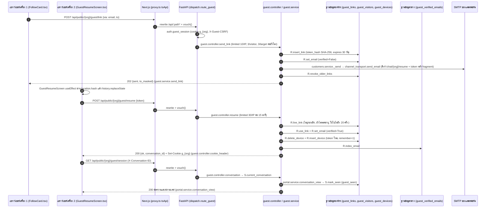
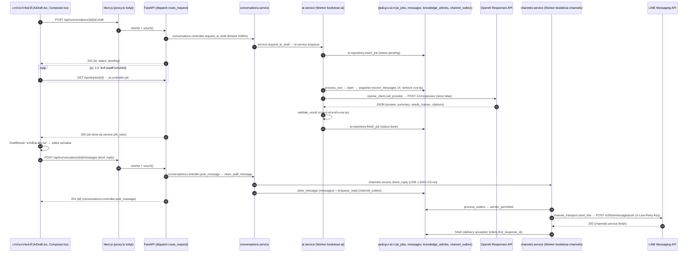
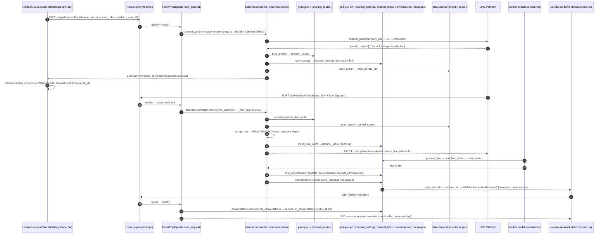

# ฟีเจอร์หลักของระบบ Customer Service (สำหรับสไลด์)

ตรวจจากซอร์สโค้ดจริงใน `backend/` และ `frontend/src/` ไม่ได้อ้างอิง README หรือเอกสารอื่น

| กลุ่มผู้ใช้ | ฟีเจอร์ |
|---|---|
| ลูกค้าไม่ล็อกอิน | 1. เริ่มแชทโดยไม่ต้องล็อกอิน · 2. ติดตามแชทข้ามอุปกรณ์ด้วยลิงก์ยืนยันตัวตน |
| ลูกค้าล็อกอิน | 3. เปิดแชทกับองค์กรและรับคำตอบจาก AI · 4. รับแจ้งเตือนคำตอบทางอีเมลและ LINE |
| เจ้าหน้าที่ | 5. ตอบลูกค้าทุกช่องทางจากกล่องข้อความเดียว · 6. ให้ AI ร่างคำตอบพร้อมอ้างอิงบทความ |
| แอดมินองค์กร | 7. เชื่อม LINE Official Account เป็นช่องทางรับเรื่อง |
| ผู้ดูแลแพลตฟอร์ม | 8. สร้างองค์กรพร้อมฐานข้อมูลแยก |

---

## ลูกค้าไม่ล็อกอิน

### 1. เริ่มแชทโดยไม่ต้องล็อกอิน

**ใครใช้ / เมื่อไร:** ผู้เยี่ยมชมที่ไม่มีบัญชี เมื่อต้องการถามองค์กรผ่านหน้าเว็บหรือ widget

**ทำงานอย่างไร**
1. เปิดหน้าแชทขององค์กร (`/chat/[org]`, `public/widget.js`)
2. ส่งข้อความแรก (`POST /api/public/{org}/guest/conversations`)
3. ระบบสร้างผู้เยี่ยมชมและอุปกรณ์ (`guest_visitors`, `guest_devices`)
4. สร้างบทสนทนา ส่งเข้า AI หรือทีมตามหมวด (`customers.service.new_web_conversation`)
5. ตั้ง cookie `g_{org}` ไว้กลับมาคุยต่อ (`guest.controller.cookie_header`)

**เงื่อนไข**
- 5 แชทใหม่/ชั่วโมงต่อ IP, 10/วันต่อผู้เยี่ยมชม, ช่องดักบอท `website` ต้องว่าง
- cookie HttpOnly อายุ 400 วัน, คำขอที่แก้ข้อมูลต้องมี `X-Guest-CSRF`

**บริการภายนอก:** OpenAI (เมื่อเปิด Chatbot)

### 2. ติดตามแชทข้ามอุปกรณ์ด้วยลิงก์ยืนยันตัวตน

**ใครใช้ / เมื่อไร:** ผู้เยี่ยมชมที่จะกลับมาดูคำตอบจากเครื่องอื่น

**ทำงานอย่างไร**
1. กรอกอีเมลในการ์ด "ติดตามแชทนี้" (`POST /api/public/{org}/guest/link`)
2. สร้าง token เก็บเฉพาะ SHA-256 (`guest_links`)
3. ส่งอีเมลลิงก์ token อยู่หลัง `#` (`channel_transport.send_email`)
4. เปิดลิงก์อีกเครื่อง ได้ cookie ใหม่และยืนยันอีเมล (`POST /api/public/{org}/guest/resume`)
5. สมัครบัญชีด้วยอีเมลเดียวกัน แชทย้ายเข้าบัญชีเอง (`guest.service.merge_verified`)

**เงื่อนไข**
- ลิงก์อายุ 30 วัน ใช้ได้ 20 ครั้ง, ลิงก์ใหม่ยกเลิกลิงก์เก่า
- ขอลิงก์ได้ 3 ครั้ง/ชั่วโมงต่อผู้เยี่ยมชม และ 10 ครั้งต่อ IP

**บริการภายนอก:** SMTP ของแพลตฟอร์ม (SMS: ไม่พบผู้ให้บริการจริงในโค้ด)

---

## ลูกค้าล็อกอิน

### 3. เปิดแชทกับองค์กรและรับคำตอบจาก AI

**ใครใช้ / เมื่อไร:** ลูกค้าที่มีบัญชี เมื่อต้องการถามหรือแจ้งปัญหา

**ทำงานอย่างไร**
1. เลือกองค์กรและหมวดเรื่อง (`NewChatForm.tsx`, `OrgPicker.tsx`)
2. สร้างบทสนทนา ส่งทีมตามหมวด (`POST /api/public/{org}/conversations`)
3. เข้าคิวงาน AI (`ai.service.on_customer_message` → `ai_jobs`)
4. Worker ค้นบทความสาธารณะและเรียก OpenAI (`ai.service.process_one`)
5. ตอบไม่ได้ ส่งต่อคนและเปิดเคส (`ai.service.handoff` → `tickets`)

**เงื่อนไข**
- ข้อความ ≤ 20,000 ตัวอักษร, แนบ 3 ไฟล์ รวม 5 MB
- AI 100 งาน/วันต่อองค์กร, ต้องอ้างอิงบทความตรงตัว ไม่อย่างนั้นส่งต่อคน

**บริการภายนอก:** OpenAI Responses API

### 4. รับแจ้งเตือนคำตอบทางอีเมลและ LINE

**ใครใช้ / เมื่อไร:** ลูกค้าที่ปิดหน้าเว็บไปแล้ว แต่อยากรู้เมื่อทีมตอบ

**ทำงานอย่างไร**
1. ขอรหัส 6 หลักแล้วพิมพ์ใน LINE OA (`POST /api/public/{org}/line`)
2. Webhook ผูกบัญชีกับ LINE (`customers.line.take_code` → `customer_line_links`)
3. ทีมตอบ ระบบเข้าคิวแจ้งเตือน (`customers.service.notify_reply` → `customer_notifications`)
4. Worker ส่งเรื่องที่ยังไม่อ่านเกิน 120 วินาที (`send_notices`, `notify.send`)

**เงื่อนไข**
- รหัส LINE อายุ 10 นาที, ผิดได้ 5 ครั้ง/ชั่วโมง
- ส่งซ้ำสูงสุด 3 ครั้ง, แจ้งเตือนมีแค่ลิงก์ ไม่มีเนื้อหาข้อความ

**บริการภายนอก:** SMTP ของแพลตฟอร์ม, LINE Messaging API

---

## เจ้าหน้าที่

### 5. ตอบลูกค้าทุกช่องทางจากกล่องข้อความเดียว

**ใครใช้ / เมื่อไร:** เจ้าหน้าที่ ระหว่างรับเรื่องจากเว็บ LINE Facebook และอีเมล

**ทำงานอย่างไร**
1. ทุกช่องทางถูกเก็บเป็นบทสนทนา (`conversations.service.store_message` → `messages`)
2. เห็นเฉพาะทีมตน ยกเว้น admin/manager (`GET /api/conversations`)
3. ส่งคำตอบหรือบันทึกภายใน (`POST /api/conversations/{id}/messages`)
4. ช่องทางภายนอกเข้าคิวส่ง (`enqueue_reply` → `channel_outbox`)
5. อัปเดต realtime หลังบันทึก (`/api/realtime/staff`)

**เงื่อนไข**
- บันทึกภายในไม่ถึงลูกค้า, agent เปิดแชททีมอื่นไม่ได้
- LINE ≤ 5,000 ตัวอักษร, Facebook ≤ 2,000 ตัวอักษร

**บริการภายนอก:** LINE Messaging API, Facebook Graph API, IMAP/SMTP ขององค์กร

### 6. ให้ AI ร่างคำตอบพร้อมอ้างอิงบทความ

**ใครใช้ / เมื่อไร:** เจ้าหน้าที่ที่อยากได้ร่างก่อนตรวจแก้และส่งเอง

**ทำงานอย่างไร**
1. กด "AI ช่วยร่าง" (`POST /api/conversations/{id}/ai-draft`)
2. สร้างงาน AI (`ai.service.enqueue` → `ai_jobs`)
3. Worker ส่งข้อความล่าสุด 14 ข้อความและบทความ (`openai_client.call_provider`)
4. ตรวจอ้างอิงแล้วเก็บร่าง (`validate_result`, `GET /api/ai/jobs/{id}`)
5. นำร่างใส่ช่องพิมพ์ แก้ แล้วส่งเอง (`Composer.tsx`)

**เงื่อนไข**
- ขอร่าง 10 ครั้ง/60 วินาทีต่อคน, ต้องเปิดใช้และมี API key
- ไม่ส่งชื่อหรืออีเมลลูกค้าให้ OpenAI

**บริการภายนอก:** OpenAI Responses API

---

## แอดมินองค์กร

### 7. เชื่อม LINE Official Account เป็นช่องทางรับเรื่อง

**ใครใช้ / เมื่อไร:** แอดมินองค์กร ตอนเปิดให้ลูกค้าทัก LINE OA

**ทำงานอย่างไร**
1. กรอก Channel Secret และ Access Token (`PATCH /api/channels/line`)
2. ตรวจกับ LINE แล้วผูก OA (`verify_line` → `channel_routes`)
3. เก็บค่าลับเป็นไฟล์ (`data/secrets/{tenant}.line.json`)
4. ลูกค้าทัก ระบบตรวจลายเซ็น (`POST /api/webhooks/line/{route_id}` → `channel_inbox`)
5. Worker สร้างบทสนทนาเข้าทีม (`process_line` → `ingest_line`)

**เงื่อนไข**
- เฉพาะ admin, หนึ่ง OA ต่อหนึ่งองค์กร
- ลายเซ็น `X-Line-Signature` ผิดได้ 403, body ≤ 2 MB

**บริการภายนอก:** LINE Messaging API

---

## ผู้ดูแลแพลตฟอร์ม

### 8. สร้างองค์กรพร้อมฐานข้อมูลแยก

**ใครใช้ / เมื่อไร:** ผู้ดูแลแพลตฟอร์ม เมื่อรับองค์กรใหม่เข้าระบบ

**ทำงานอย่างไร**
1. กรอกชื่อ รหัสองค์กร และแอดมินคนแรก (`POST /api/platform/tenants`)
2. ตรวจสิทธิ์และรหัสซ้ำ (`auth.require_platform_admin`, `slug_taken`)
3. บันทึกองค์กรในฐานข้อมูลกลาง (`platform.service.create_tenant` → `tenants`)
4. สร้างไฟล์ฐานข้อมูลของตัวเอง (`D.create_tenant_database` → `data/tenants/{id}.sqlite3`)
5. ผูกแอดมินและบันทึก audit (`memberships`, `audit_logs`)

**เงื่อนไข**
- รหัสองค์กร ≤ 60 ตัว ใช้ `a-z 0-9 -` ห้ามซ้ำ
- ระงับองค์กรต้องพิมพ์ `CONFIRM` หรือชื่อองค์กร

**บริการภายนอก:** ไม่มี

---

# Sequence diagram ของ 3 use case ที่ซับซ้อนที่สุด

เลือกจาก use case ในภาพ โดยดูจำนวนระบบ ตาราง และงานเบื้องหลังที่เกี่ยวข้อง

| # | Use case | เหตุผลที่ซับซ้อน |
|---|---|---|
| A | ติดตามเคส «include» ยืนยันตัวตนด้วยลิงก์ | ใช้ 2 อุปกรณ์, token ใช้ครั้งเดียวต่อรอบ, อีเมลภายนอก, ฐานข้อมูลองค์กรและฐานข้อมูลกลาง |
| B | ให้ AI ร่างคำตอบ «extend» ตอบข้อความลูกค้า | งานคิว + worker, OpenAI, การตรวจอ้างอิง, ส่งต่อผ่าน LINE และ realtime |
| C | ตั้งช่องทางรับเรื่อง (LINE) | ตรวจกับ LINE, เก็บค่าลับ, webhook ลายเซ็น HMAC, worker สร้างบทสนทนา, realtime เข้ากล่องข้อความ |

## A. ติดตามเคส — ยืนยันตัวตนด้วยลิงก์ทางอีเมล

## B. ให้ AI ร่างคำตอบ แล้วตอบข้อความลูกค้าทาง LINE

## C. ตั้งช่องทางรับเรื่อง LINE จนข้อความเข้ากล่องข้อความ

