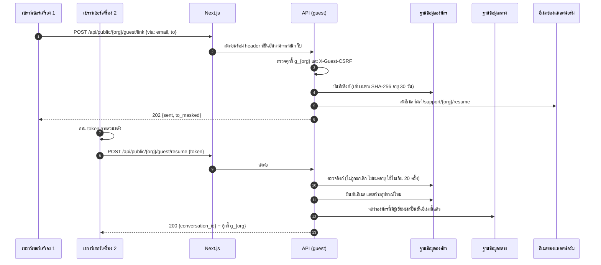
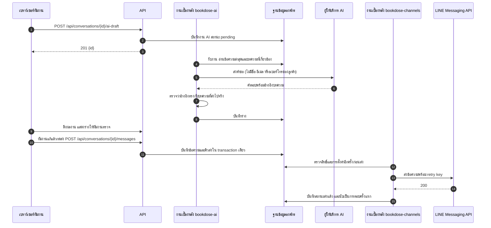
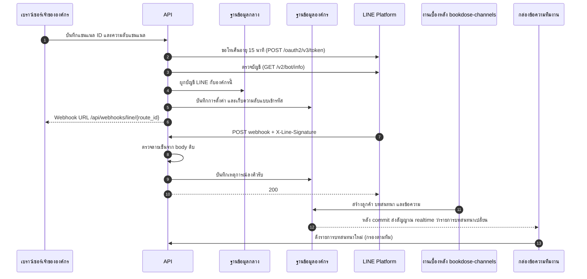

# สถาปัตยกรรม

เอกสารนี้อธิบายว่าระบบประกอบด้วยอะไร คำขอหนึ่งเดินผ่านอะไรบ้าง ข้อมูลเก็บอย่างไร และทำไมจึงออกแบบแบบนี้

## ภาพรวม

```text
เบราว์เซอร์
   │  https
   ▼
หน้าเว็บ Next.js (frontend/, พอร์ต 3000)
   │  หน้าจอทั้งหมด, CSP แบบ nonce ต่อคำขอ, ส่งต่อ /api/* และ WebSocket
   ▼
API FastAPI บน uvicorn (app.py, พอร์ต 8787, worker เดียว)
   │  dispatch → middleware ตามระดับสิทธิ์ → controller → service → repository
   ▼
SQLite
   ├─ control.sqlite3              ฐานข้อมูลกลาง
   └─ tenants/<tenant-id>.sqlite3  ฐานข้อมูลของแต่ละองค์กร
```

งานเบื้องหลังรันเป็น thread อยู่ใน process เดียวกับ API และคุยกับบริการภายนอก เช่น LINE, Meta, อีเมล และ AI

## ส่วนที่ 1: หน้าเว็บ

หน้าเว็บเป็น Next.js (App Router) ทำหน้าที่ 3 อย่าง

1. **แสดงหน้าจอ** ทุกหน้าจอเป็น client component อ่านข้อมูลจาก API ผ่าน TanStack Query
2. **ส่งต่อคำขอ** `next.config.ts` ส่งต่อ `/api/*` ไปที่ API รวมถึงคำขอ upgrade ของ WebSocket เบราว์เซอร์จึงไม่เคยคุยกับ API โดยตรง คุกกี้ CSRF และ `X-Tenant-ID` เป็น same-origin ทั้งหมด
3. **ด่านแรกของทุกคำขอ** `src/proxy.ts` ทำงานก่อนทุกคำขอ
   - สร้าง nonce ใหม่ทุกหน้า แล้วประกอบ Content-Security-Policy
   - บอก API ว่าเบราว์เซอร์ใช้โฮสต์อะไร (`X-Forwarded-Host`) และมาจาก IP ไหน (`X-Bookdose-Client-IP`) พร้อมความลับร่วม `BOOKDOSE_PROXY_SECRET`
   - ให้หน้าแชทแบบฝังใส่ในกรอบเว็บไซต์ขององค์กรได้เฉพาะเว็บไซต์ที่องค์กรอนุญาต
   - รายงานการแตะเส้นทางล่อไปที่ API

หน้าเว็บซ่อนปุ่มตามบทบาทได้ แต่ไม่ใช่ด่านป้องกัน สิทธิ์ทุกอย่างตรวจที่ API

## ส่วนที่ 2: API

### เส้นทางของคำขอ

```text
uvicorn
  └─ FastAPI route เดียวรับทุก path (backend/asgi.py)
       └─ dispatch() (backend/http/dispatch.py)
            ├─ ตรวจ IP ที่ถูกบล็อก และกับดัก
            ├─ ตรวจ Host / Origin และใส่ security header
            ├─ หา route จากตารางของทุกโมดูล (backend/modules/*/routes.py)
            ├─ middleware ตามระดับสิทธิ์ของ route
            └─ controller → service → repository → SQLite
```

FastAPI ทำหน้าที่เป็นตัวรับส่งเท่านั้น ไม่มี `/docs` หรือ `/openapi.json` และหน้า error ของ FastAPI ถูกแทนด้วย `{error: "ข้อความภาษาไทย"}` พร้อม security header ทุกครั้ง

### ระดับสิทธิ์ของ route

ทุก route ประกาศระดับของตัวเองในตาราง `(method, path, controller, access)` dispatcher ตรวจตามลำดับนี้

| ระดับ | ใครเรียกได้ |
|---|---|
| `page` | ไม่ต้องเข้าสู่ระบบ คำตอบที่ไม่ใช่ JSON เช่น ลิงก์ไฟล์ชั่วคราว |
| `webhook` | ผู้ให้บริการภายนอก ตรวจด้วยลายเซ็นจาก body ดิบ |
| `portal` | ใครก็ได้ที่ติดต่อองค์กรที่ยังเปิดใช้งาน (`/api/public/<code>`) |
| `customer` | ลูกค้าที่เข้าสู่ระบบ ภายใต้ `/api/public/<code>` |
| `guest-open`, `guest` | ผู้เยี่ยมชมที่แชทโดยไม่มีบัญชี (`guest` ต้องมีคุกกี้ผู้เยี่ยมชม) |
| `customer-public`, `customer-account` | บัญชีลูกค้า (`/api/customer/`) แบบยังไม่เข้าสู่ระบบ และเข้าสู่ระบบแล้ว |
| `public` | สมัคร ตั้งค่าครั้งแรก เข้าสู่ระบบ |
| `session` | อาจยังไม่เข้าสู่ระบบ เช่น `/api/bootstrap` |
| `account` | เข้าสู่ระบบแล้วและผ่าน CSRF |
| `platform` | ผู้ดูแลแพลตฟอร์มเท่านั้น |
| `workspace` | สมาชิกขององค์กรที่เลือกอยู่ ต้องส่ง `X-Tenant-ID` ให้ตรงกับเซสชัน |

งานที่เป็นของเจ้าขององค์กรกั้นเพิ่มที่ controller ด้วย `@require_role('admin')`

### ชั้นของโค้ดในแต่ละโมดูล

**routes → controller → service → repository → database** รายละเอียดอยู่ใน [โครงสร้างโค้ด](code-structure.md)

## ส่วนที่ 3: ข้อมูล

### ฐานข้อมูลกลางและฐานข้อมูลขององค์กร

| ฐานข้อมูล | เก็บอะไร |
|---|---|
| `control.sqlite3` | บัญชีทีมงานและลูกค้า เซสชัน องค์กร สมาชิก คำเชิญ การตั้งค่าแพลตฟอร์ม FAQ กลาง เหตุการณ์ความปลอดภัย และตารางที่ต้องใช้ข้ามองค์กร เช่น การผูก LINE OA หรือเพจกับองค์กร |
| `tenants/<id>.sqlite3` | งานทั้งหมดขององค์กร: บทสนทนา ข้อความ เคส ลูกค้า คลังความรู้ ระบบอัตโนมัติ การตั้งค่า คิวส่งข้อความ งาน AI และประวัติการทำงาน |

แต่ละองค์กรมีไฟล์ฐานข้อมูลของตัวเอง ไม่ใช่ตารางเดียวกันแล้วกรองด้วย `tenant_id` คิวรีใดจึงเห็นข้อมูลข้ามองค์กรไม่ได้ตั้งแต่แรก

### การปรับโครงสร้างฐานข้อมูล

แต่ละโมดูลประกาศตารางใน `model.py` ตอนเปิด API `backend/database/schema.py` สร้างตารางที่ยังไม่มีและเพิ่มคอลัมน์ใหม่ การปรับเป็นแบบเพิ่มอย่างเดียวและรันซ้ำได้ ไม่ลบข้อมูลเดิม

### การส่งเหตุการณ์หลัง commit

connection ของ SQLite ในระบบนี้มี `after_commit` งานที่ต้องเกิดหลังบันทึกสำเร็จ เช่น การส่งเหตุการณ์ realtime จะทำหลัง commit เท่านั้น ถ้า rollback ก็ไม่เกิด

## ส่วนที่ 4: งานเบื้องหลัง

`backend/workers.py` เริ่มงานเบื้องหลังครั้งเดียวต่อ process รายชื่องานอยู่ใน [ดูแลระบบ](operations.md#งานเบื้องหลัง)

หลักที่ทุกงานใช้

- **ไม่เรียกบริการภายนอกระหว่างเปิด transaction** เช่น ส่ง LINE เรียก AI หรือส่งอีเมล ทำหลังบันทึกข้อมูลแล้วเสมอ ฐานข้อมูลจึงไม่ถูกล็อกระหว่างรอเครือข่าย
- **คิวแบบ outbox** ข้อความตอบลูกค้าทางช่องทางภายนอกบันทึกลงคิวใน transaction เดียวกับข้อความ แล้วงานเบื้องหลังจึงส่ง ข้อความไม่หายแม้ระบบดับระหว่างส่ง
- **งาน AI เป็นคิวในฐานข้อมูลขององค์กร** หน้าที่รับข้อความจากลูกค้าไม่รอ AI

## ส่วนที่ 5: การอัปเดตสด

socket ส่งแค่ "มีอะไรเปลี่ยน" แล้วหน้าเว็บดึงข้อมูลใหม่ผ่าน REST เหมือนเดิม สิทธิ์ทั้งหมดจึงยังตรวจที่ REST รายละเอียดใน [การอัปเดตสด](realtime.md)

## ส่วนที่ 6: บริการภายนอก

| บริการ | ใช้ทำอะไร | โค้ด |
|---|---|---|
| LINE Messaging API | รับส่งข้อความ LINE OA | `backend/extensions/channel_transport.py` |
| Meta Graph API | Facebook Messenger และ Instagram | `channel_transport.py` |
| IMAP / SMTP | รับส่งอีเมลขององค์กร และอีเมลของแพลตฟอร์ม | `channel_transport.py` |
| Google / Microsoft OAuth | เชื่อมกล่องอีเมลแบบ OAuth | `backend/modules/channels/email_oauth.py` |
| OpenAI Responses API | AI ขององค์กร | `backend/extensions/openai_client.py` |
| Google Gemini | AI ขององค์กรเมื่อใช้คีย์ Gemini | `backend/extensions/gemini_client.py` |
| n8n Webhook | AI ผ่าน workflow ขององค์กร | `backend/extensions/ai_webhook.py` |
| ThaiBulkSMS / Twilio | ส่ง SMS ลิงก์ติดตามแชท | `backend/extensions/sms.py` |
| Cloudflare Turnstile | ตรวจว่าเป็นคนจริงในฟอร์มเริ่มแชทสาธารณะ | `backend/extensions/turnstile.py` |
| OSV.dev | ตรวจช่องโหว่ของไลบรารีวันละครั้ง | `backend/modules/platform/vulns.py` |

ทุกคำขอที่มีความลับไม่ยอมตาม redirect ความลับจึงไปถึงเฉพาะ URL ของผู้ให้บริการเอง

## การตัดสินใจสำคัญ

| เรื่อง | เลือกแบบนี้ | เหตุผล |
|---|---|---|
| ฐานข้อมูล | SQLite แยกไฟล์ต่อองค์กร | เปิดใช้บนเครื่องได้ทันทีโดยไม่ต้องตั้งเซิร์ฟเวอร์ฐานข้อมูล และแยกข้อมูลองค์กรออกจากกันจริง |
| จำนวน process | API worker เดียว | การจำกัดคำขอ เซสชัน WebSocket และงานเบื้องหลังอยู่ในหน่วยความจำของ process เดียว |
| ไลบรารี | ใช้ standard library ของ Python เป็นหลัก | พึ่งพาภายนอกน้อย ไลบรารีที่ใช้มีเพียงชั้นเว็บเซิร์ฟเวอร์ (FastAPI, uvicorn, websockets) และ `cryptography` สำหรับเข้ารหัส |
| ภาษาของหน้าจอ | ภาษาไทยทั้งหมด | ผู้ใช้เป็นคนไทย ดู [การออกแบบ UI/UX](ui-ux.md) |
| socket | ส่งแค่สัญญาณ ไม่ส่งข้อมูล | กติกาสิทธิ์อยู่ที่เดียวคือ REST |
| สิทธิ์ | ตรวจที่ API ทุกคำขอ | หน้าเว็บเป็นเพียงผู้แสดงผล |

## ข้อจำกัดที่รู้อยู่

- รัน API หลาย worker หรือหลายเครื่องไม่ได้ ถ้าต้องขยาย ต้องมีตัวกลางส่งข้อความ เช่น Redis และย้ายการจำกัดคำขอกับเซสชันออกนอก process
- SQLite รองรับการเขียนพร้อมกันได้จำกัด
- ยังไม่ได้ทดสอบรับโหลดระดับแพลตฟอร์มสาธารณะ

## เซิร์ฟเวอร์รุ่นเก่า

เดิม API ใช้ `http.server` ของ Python ที่เขียนเอง ปัจจุบันย้ายมาใช้ FastAPI บน uvicorn แล้ว โดย route middleware และข้อความ error เหมือนเดิมทุกอย่าง เพราะทั้งสองแบบตอบผ่าน `dispatch()` ตัวเดียวกัน

เซิร์ฟเวอร์รุ่นเก่ายังเปิดได้ด้วย `BOOKDOSE_SERVER=legacy` ไว้ย้อนกลับเท่านั้น รุ่นเก่าไม่มี WebSocket หน้าเว็บจะดึงข้อมูลตามรอบแทน

## ลำดับการทำงานสำคัญ

### ผู้เยี่ยมชมติดตามแชทข้ามเครื่องด้วยลิงก์ทางอีเมล



### ทีมงานให้ AI ร่างคำตอบ แล้วส่งทาง LINE



### เชื่อม LINE จนข้อความแรกเข้ากล่องข้อความ


